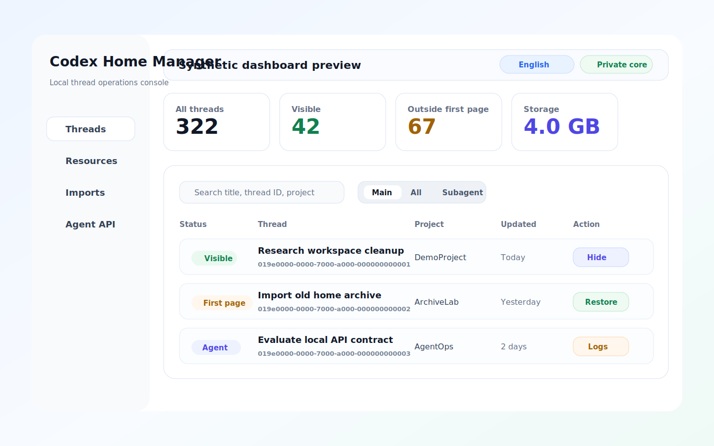

# Codex Home Manager

Public website and sanitized product preview for Codex Home Manager.

Codex Home Manager is a local-first operations console for inspecting and maintaining a Codex Desktop home directory: threads, project bindings, local resources, imports, backups, logs, and agent-facing APIs.



## What is included

- Static product website deployed on Cloudflare Pages.
- A synthetic, privacy-safe product preview with mock projects and mock thread names.
- Public-facing API capability overview and safety model documentation.
- Launch and security notes for evaluating the product without exposing local data.

## What is intentionally not included

This repository does not contain the private local engine or implementation code that can read, repair, migrate, slim, or write a real Codex Home directory.

Excluded by design:

- Local SQLite and JSONL manipulation code.
- Real Codex Desktop session data, logs, exports, backups, or screenshots.
- Token handling, write-gate implementation, preview ticket validation, and restore internals.
- Any user-specific project paths, conversation titles, memory files, or machine identifiers.

The public preview is suitable for product review and deployment. It is not the runnable local maintenance engine.

## Local preview

Open `site/index.html` directly in a browser, or serve the directory with any static server:

```powershell
cd codex-home-manager-public
npx wrangler pages dev site
```

## Deployment

The production site is designed for Cloudflare Pages:

```powershell
npx wrangler pages deploy site --project-name codex-home-manager --branch main
```

Current public preview: <https://codex-home-manager.pages.dev/>.

Planned custom domain: `codex-home-manager.simplezion.com`. The domain is intentionally not treated as live until the Cloudflare DNS CNAME record is active.

## Privacy stance

All visible product data in this repository is synthetic. Screenshots and UI mockups are generated from fake project names, fake thread names, fake IDs, and fake paths. No real Codex Home content is committed.
