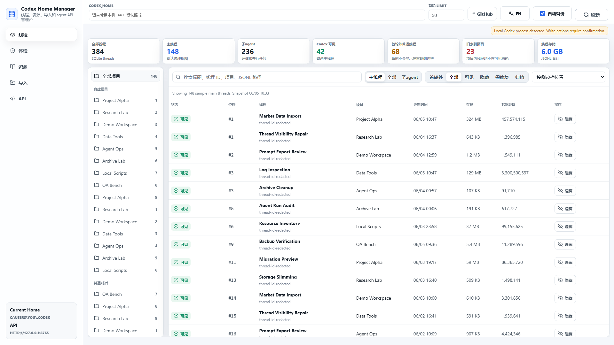
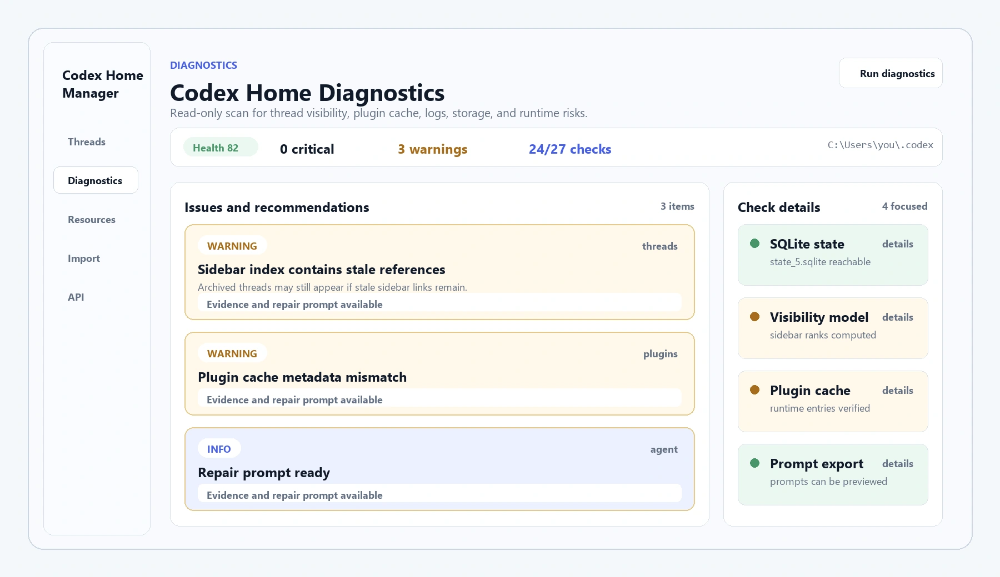
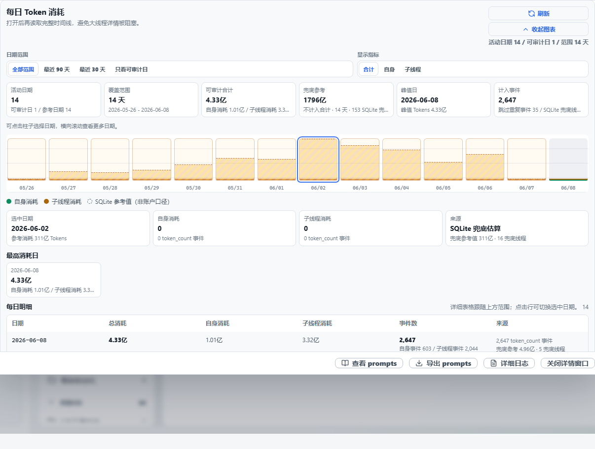

# Codex Home Manager

The default `source` branch contains the complete open-source Codex Home Manager product. This `main` branch is the deployed static-site and release-artifact boundary.

The hosted page has two operating modes:

- Browser folder mode: the user manually selects a local `.codex` directory in a Chromium browser. The page can read thread JSONL, resources, logs, diagnostics inputs, and prompt exports through the browser File System Access API. This mode is read-only.
- Local connector mode: the user runs the Windows connector on their own machine at `http://127.0.0.1:8765`. The connector enables the full local management surface, including repairs, migration, deletion, slimming, MCP, process checks, and guarded writes.

The hosted browser bundle does not execute the local connector backend and does not upload `.codex` data. The complete local connector and backend source remains available on the [`source` branch](https://github.com/SimpleZion/codex-home-manager/tree/source).



Diagnostics view:



Thread detail daily token timeline:



## What is included on `main`

- The static web frontend deployed on Cloudflare Pages.
- Public release downloads for the Windows local connector.
- A public API capability overview, MCP-oriented endpoints, and safety boundary notes.
- Cloudflare Pages deployment files.
- Signed release metadata and public verification material.

## Deployment boundary

The complete implementation that reads, repairs, migrates, slims, and writes a Codex Home is open source on the [`source` branch](https://github.com/SimpleZion/codex-home-manager/tree/source). It is intentionally not bundled into the hosted static JavaScript or duplicated on this deployment branch.

Excluded from the deployed static branch and release downloads by design:

- Real Codex Desktop session data, logs, exports, backups, or screenshots.
- Private signing keys, credentials, tokens, local databases, and diagnostics snapshots.
- Any user-specific project paths, conversation titles, memory files, or machine identifiers.

Source review, issues, and contributions should target the default `source` branch.

## Use the hosted product

Open:

<https://codex-home-manager.simplezion.com/>

For read-only use, choose `.codex` directly from the hosted page in a Chromium browser.

For the full local management mode on Windows, download and run the local connector:

<https://github.com/SimpleZion/codex-home-manager/releases/latest/download/codex-home-manager-local-win-x64.exe>

The connector starts the full local product at `http://127.0.0.1:8765/` and registers the `codex-home-manager://start` browser protocol for the current Windows user.

The current Windows build is unsigned. If Windows SmartScreen shows "Windows protected your PC", choose "More info" and then "Run anyway" to start the app.

Agents can use the same local connector directly through HTTP or MCP. Thread detail reads can skip the heavier daily token timeline, then load `/api/threads/{thread_id}/daily-tokens` only when that visualization or audit data is needed. That endpoint returns numeric token usage only from auditable `token_count` events. Threads that only have SQLite `tokens_used` are marked with `unknownTokenThreads`; no token value is returned for those unknown records.

## Local preview

Open `site/index.html` directly in a browser, or serve the directory with any static server:

```powershell
cd codex-home-manager-public
npx wrangler pages dev site
```

## Deployment

The production site is designed for Cloudflare Pages:

```powershell
npx wrangler pages deploy site --project-name codex-home-manager --branch main
```

Production custom domain: <https://codex-home-manager.simplezion.com/>.

## Signed release proof

The release manifest signs the immutable artifact deployment, GitHub Release identity, EXE and ZIP hashes, and source commits. Release mode refuses to proceed unless `release-manifest.json`, its detached Ed25519 signature, the public key, and the published fingerprint are all present. The verifier requires `CODEX_HOME_MANAGER_RELEASE_PUBLIC_KEY_SHA256` from an independently retained publisher trust record and rejects a fingerprint learned only from either download channel.

Final publication downloads the EXE, ZIP, manifest, detached signature, and public key independently from Cloudflare Pages and GitHub Release. It requires byte-identical metadata and artifacts, an exact GitHub asset set, valid Cloudflare deployment evidence, valid Ed25519 signing, and stable aliases that resolve to the current content-addressed files.

Authenticode is reported only when the build machine already has a trusted Windows code-signing certificate with a private key and a valid chain. The release process never creates or presents a self-signed certificate as trusted. When no trusted certificate is available, metadata states `authenticode.status = "unavailable"`; the detached Ed25519 signature and independently pinned root remain mandatory in both cases.

## Privacy stance

The deployed frontend can read real Codex Home data only from a user-selected local folder or from the user's own local connector API. Real Codex Home content is not uploaded by the hosted page. No real session JSONL, SQLite database, logs, exports, backups, screenshots, or user-specific paths are committed.
