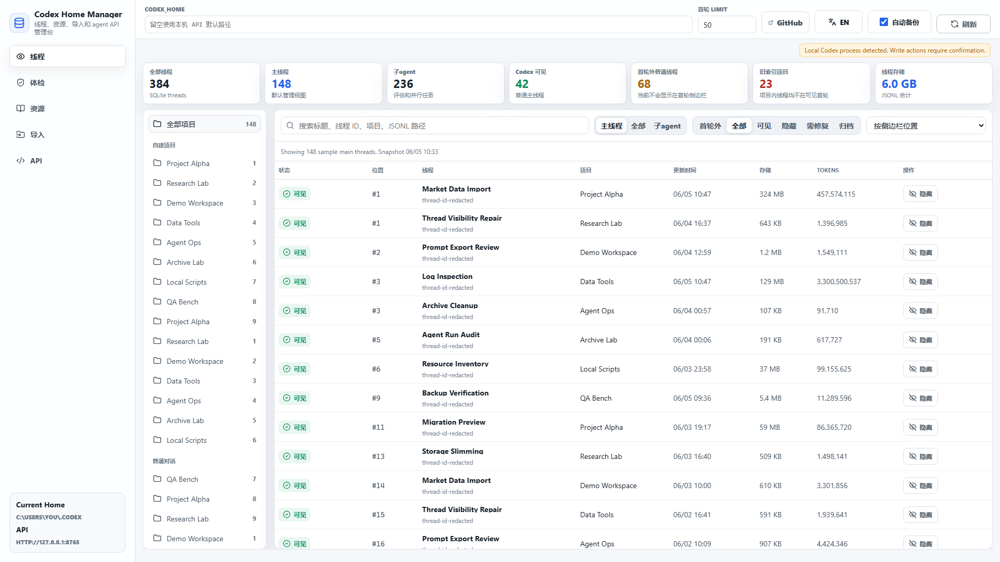
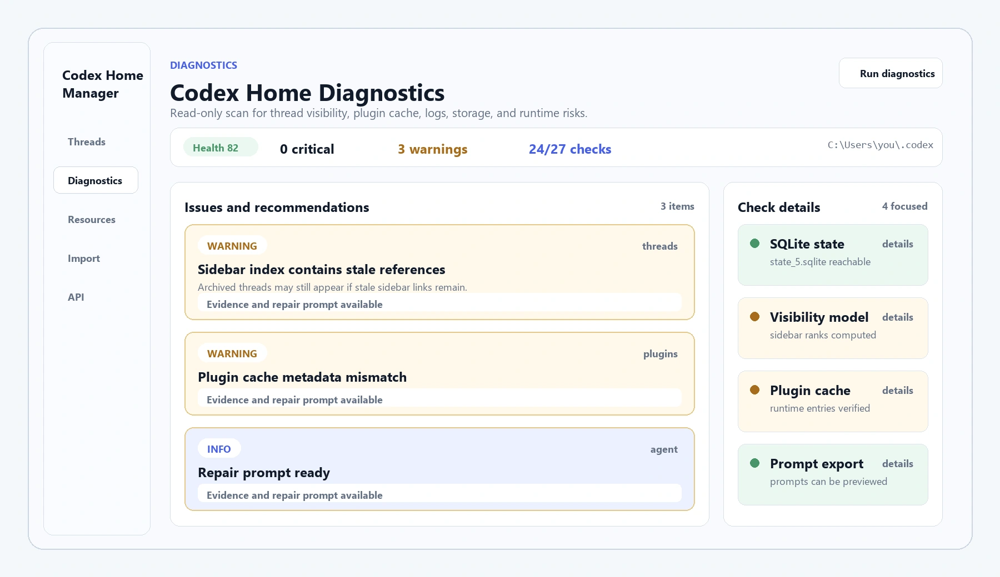
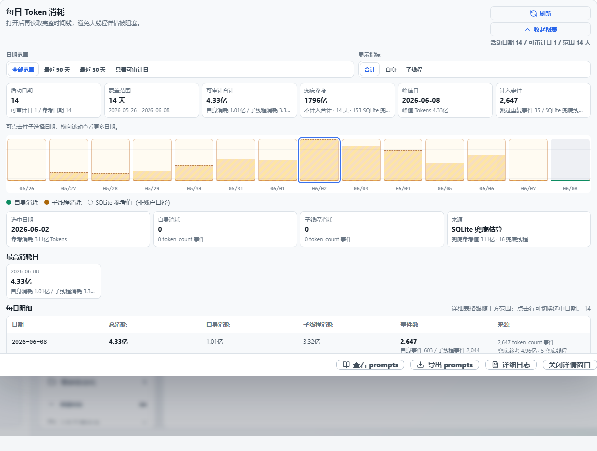

# Codex Home Manager

[](https://github.com/SimpleZion/codex-home-manager/actions/workflows/source-ci.yml?query=branch%3Asource)

The default `source` branch contains the complete open-source Codex Home Manager product. This `main` branch is the deployed static-site and release-artifact boundary.

The hosted page has two operating modes:

- Browser folder mode: the user manually selects a local `.codex` directory in a Chromium browser. The page can read thread JSONL, resources, logs, diagnostics inputs, and prompt exports through the browser File System Access API. This mode is read-only.
- Local connector mode: the user runs the Windows connector on their own machine at `http://127.0.0.1:8765`. The connector enables the full local management surface, including repairs, migration, deletion, slimming, MCP, process checks, and guarded writes.

The hosted browser bundle does not execute the local connector backend and does not upload `.codex` data. The complete local connector and backend source remains available on the [`source` branch](https://github.com/SimpleZion/codex-home-manager/tree/source).



Diagnostics view:



Thread detail daily token timeline:



## What is included on `main`

- The static web frontend deployed on Cloudflare Pages.
- Public release downloads for the Windows local connector.
- A public API capability overview, MCP-oriented endpoints, and safety boundary notes.
- Cloudflare Pages deployment files.
- Signed release metadata and public verification material.

## Deployment boundary

The complete implementation that reads, repairs, migrates, slims, and writes a Codex Home is open source on the [`source` branch](https://github.com/SimpleZion/codex-home-manager/tree/source). It is intentionally not bundled into the hosted static JavaScript or duplicated on this deployment branch.

Excluded from the deployed static branch and release downloads by design:

- Real Codex Desktop session data, logs, exports, backups, or screenshots.
- Private signing keys, credentials, tokens, local databases, and diagnostics snapshots.
- Any user-specific project paths, conversation titles, memory files, or machine identifiers.

Source review, issues, and contributions should target the default `source` branch.

## Use the hosted product

Open:

<https://codex-home-manager.simplezion.com/>

For read-only use, choose `.codex` directly from the hosted page in a Chromium browser.

For the full local management mode on Windows, download and run the local connector:

- [Download the stable Windows connector](https://codex-home-manager.simplezion.com/downloads/latest/windows-x64.exe)
- [Open the latest GitHub Release](https://github.com/SimpleZion/codex-home-manager/releases/latest) for release notes and immutable, content-addressed assets.

The website URL is the stable download alias. It redirects to the current content-addressed EXE published by the same release process; GitHub Releases intentionally contains the content-addressed asset name rather than a second mutable `codex-home-manager-local-win-x64.exe` asset.

Before running the connector, use [`verify-codex-home-manager.ps1`](https://codex-home-manager.simplezion.com/verify-codex-home-manager.ps1). The verifier has the independently retained Ed25519 SPKI SHA-256 trust anchor `sha256:ef7194fbc8fa8550430c908d9d02c74f7fc0d1e87f7f9b4ec5a164526b48f208` embedded in its source. It verifies the downloaded PEM against that fixed fingerprint, verifies `release-manifest.json.sig`, and only then reads the signed EXE or ZIP size and SHA-256 from the manifest:

```powershell
$releaseBase = "https://codex-home-manager.simplezion.com"
$release = Invoke-RestMethod "$releaseBase/connector-release.json"
$artifactName = ($release.artifacts | Where-Object kind -eq "exe").name
$artifactPath = Join-Path "$env:USERPROFILE\Downloads" $artifactName
Invoke-WebRequest "$releaseBase/$artifactName" -OutFile $artifactPath
Invoke-WebRequest "$releaseBase/verify-codex-home-manager.ps1" -OutFile .\verify-codex-home-manager.ps1
PowerShell -NoProfile -ExecutionPolicy Bypass -File .\verify-codex-home-manager.ps1 -FilePath $artifactPath
```

Windows PowerShell 5.1 has no native Ed25519 API, so the verifier requires an installed Python 3 interpreter with the audited `cryptography` package. If that dependency is absent, verification stops with an explicit error; it never falls back to `SHA256SUMS.txt`, `connector-release.json`, or another replaceable hash from the same origin. The published [`release-signing-public-key.sha256`](https://codex-home-manager.simplezion.com/release-signing-public-key.sha256) is informational and is not a trust anchor for this verifier.

The verifier checks [`release-manifest.json.sig`](https://codex-home-manager.simplezion.com/release-manifest.json.sig) over the downloaded manifest with [`release-signing-public-key.pem`](https://codex-home-manager.simplezion.com/release-signing-public-key.pem). The signed manifest binds the source commits, immutable EXE/ZIP hashes, Cloudflare deployment, and GitHub Release identity. [`SHA256SUMS.txt`](https://codex-home-manager.simplezion.com/SHA256SUMS.txt) remains useful for transfer diagnostics after signature verification, but a same-origin checksum alone does not authenticate a release.

The connector starts the full local product at `http://127.0.0.1:8765/` and registers the `codex-home-manager://start` browser protocol for the current Windows user.

When no publicly trusted code-signing certificate is configured, Windows reports the connector as `NotSigned` and release metadata records `status = "not-signed"` with `trust = "none"`. The project does not create or claim a self-signed Authenticode publisher identity. Windows SmartScreen may still warn; release authenticity is established by the independently pinned Ed25519 manifest verification above.

Agents can use the same local connector directly through HTTP or MCP. Thread detail reads can skip the heavier daily token timeline, then load `/api/threads/{thread_id}/daily-tokens` only when that visualization or audit data is needed. That endpoint returns numeric token usage only from auditable `token_count` events. Threads that only have SQLite `tokens_used` are marked with `unknownTokenThreads`; no token value is returned for those unknown records.

## Local preview

Open `site/index.html` directly in a browser, or serve the directory with any static server:

```powershell
cd codex-home-manager-public
npx wrangler pages dev site
```

## Deployment

The production site is designed for Cloudflare Pages:

```powershell
npx wrangler pages deploy site --project-name codex-home-manager --branch main
```

Production custom domain: <https://codex-home-manager.simplezion.com/>.

## Source CI and supply-chain evidence

[`Source CI`](https://github.com/SimpleZion/codex-home-manager/actions/workflows/source-ci.yml?query=branch%3Asource) runs on GitHub-hosted Windows runners for every push and pull request targeting `source`. It verifies the exported source manifest, installs Python dependencies from hash-locked requirements and Node dependencies with `npm ci`, builds the frontend, runs the complete quality gate, and builds the final content-addressed Windows EXE and ZIP with the same packaging script used by release preparation.

Successful pushes to `source` preserve two independent evidence sets. `source-release-evidence-<commit>` contains the exact source archive, source CycloneDX SBOM, tests, and source attestations. `windows-release-evidence-<commit>` contains the final EXE and ZIP, a binary CycloneDX SBOM generated from those artifacts, an SBOM attestation bound to the EXE and ZIP, and provenance covering the EXE, ZIP, and binary SBOM. Download the artifacts from the matching workflow run and verify each subject with:

```powershell
gh attestation verify .\codex-home-manager-source-<commit>.zip --repo SimpleZion/codex-home-manager
gh attestation verify .\codex-home-manager-local-win-x64-v<version>-<hash>.exe --repo SimpleZion/codex-home-manager
gh attestation verify .\codex-home-manager-local-win-x64-v<version>-<hash>.zip --repo SimpleZion/codex-home-manager
gh attestation verify .\codex-home-manager-windows-x64-<commit>.cdx.json --repo SimpleZion/codex-home-manager
```

Release publication must select evidence from the exact source commit, verify the attestation before use, and include the SBOM/provenance hashes in the Ed25519-signed release manifest. A passing badge or an unverified workflow artifact alone is not release proof.

## Signed release proof

The release manifest signs the immutable artifact deployment, GitHub Release identity, EXE and ZIP hashes, and source commits. Release mode refuses to proceed unless `release-manifest.json`, its detached Ed25519 signature, the public key, and the published fingerprint are all present. Publication gates require `CODEX_HOME_MANAGER_RELEASE_PUBLIC_KEY_SHA256` from an independently retained publisher trust record. The user verifier separately embeds the same reviewed SPKI fingerprint and does not learn trust from either download channel.

Final publication downloads the EXE, ZIP, manifest, detached signature, and public key independently from Cloudflare Pages and GitHub Release. It requires byte-identical metadata and artifacts, an exact GitHub asset set, valid Cloudflare deployment evidence, valid Ed25519 signing, and stable aliases that resolve to the current content-addressed files.

Authenticode metadata separates signature presence from trust. Only a certificate with a validated public trust chain may use `status = "valid"` and `trust = "public-trusted"`. Without that certificate, packaging requires the EXE to have Windows status `NotSigned` and records `status = "not-signed"` with `trust = "none"`; it does not create or accept a self-signed release signature. The detached Ed25519 signature and independently pinned root remain mandatory in every case.

## Privacy stance

The deployed frontend can read real Codex Home data only from a user-selected local folder or from the user's own local connector API. Real Codex Home content is not uploaded by the hosted page. No real session JSONL, SQLite database, logs, exports, backups, screenshots, or user-specific paths are committed.
